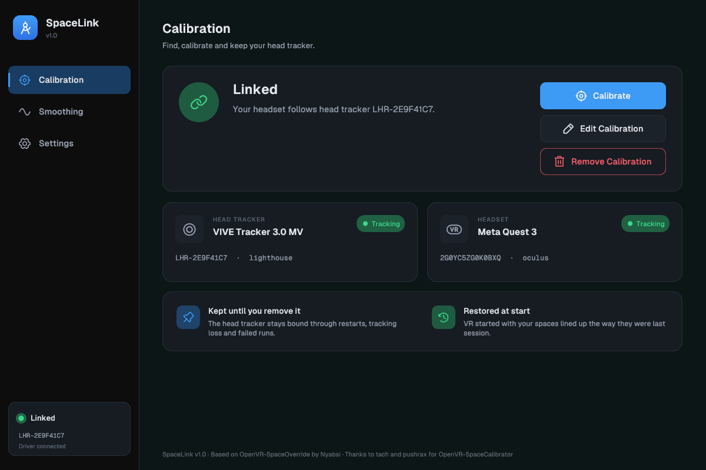
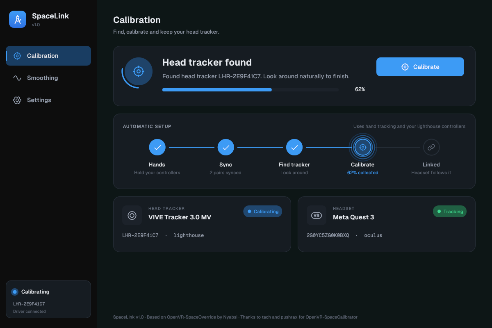

# OpenVR-SpaceLink

<p align="center">
  
  
</p>

SpaceLink lines up an inside-out headset (Quest, Pico and similar) with your lighthouse devices, using a Vive tracker mounted on the headset. It calibrates itself with hand tracking, and it stays calibrated from one VR session to the next.

- **Fast automatic calibration with hand tracking.** Turn on hand tracking (for example Virtual Desktop's hand tracking on Quest), hold your lighthouse controllers and look around. SpaceLink finds the tracker on your headset and calibrates it by itself, without a button.
- **Calibration that survives turning VR off.** The head tracker and its calibration stay until you remove them, and when VR starts again, SpaceLink restores how your tracking spaces lined up at the end of the last session. If your headset's coordinate system hasn't changed (for example, the same Quest boundary), VR starts already aligned, even before the tracker is tracking.

SpaceLink is a fork of [OpenVR-SpaceOverride](https://github.com/Nyabsi/OpenVR-SpaceOverride) by Nyabsi and installs as a drop-in replacement for it, keeping your existing calibration.

## How it works

Classic space calibration computes a one-time offset between two tracking systems, and the two slowly slide apart afterwards. SpaceLink keeps OpenVR-SpaceOverride's answer to that: a Vive tracker is rigidly mounted on the headset, and after calibration the driver stops using the headset's own pose and rebuilds it from the tracker instead. The headset and all your other lighthouse devices then share one tracking system, so there is nothing left to drift against.

The headset's own (SLAM) tracking is still there underneath. It keeps your view going while the tracker is out of sight, and SpaceLink uses it to keep everything else the headset tracks, such as its own controllers or your hands, lined up with your lighthouse space.

## Requirements

- Lighthouse tracking (or an equivalent system) for your trackers and controllers
- A tracker rigidly mounted on the headset (Vive Tracker 3.0 or equivalent)
- A headset with inside-out (SLAM) or other positional tracking of its own
- For automatic calibration: hand tracking that reaches SteamVR (for example Virtual Desktop's hand tracking on Quest) and lighthouse controllers to hold

## Installing

Download `OpenVR-SpaceLink_Installer.exe` from the [Releases page](https://github.com/EVSkyFall/OpenVR-SpaceLink/releases), close SteamVR, and run it. It installs SpaceLink to `C:\Program Files\OpenVR-SpaceLink` and adds it to the Windows app list and the Start menu under the name SpaceLink. It also registers the driver, sets SpaceLink to start with SteamVR, and turns on SteamVR's support for multiple tracking systems, so there is no SteamVR config to edit by hand. Then start SteamVR and open SpaceLink from the dashboard, or use its window on the desktop. To upgrade later, run the newer installer the same way; it reinstalls SpaceLink in place.

SpaceLink replaces OpenVR-SpaceOverride rather than running next to it, because both use the same driver. If OpenVR-SpaceOverride is installed, the installer replaces it for you without asking, and your calibration carries over, since your settings live in your user registry, not in the install folder. A few things still carry the old name: the SteamVR add-on list shows the driver as `spaceoverride`, the overlay executable is `OpenVR-SpaceOverride.exe`, and the log folder is `%LOCALAPPDATA%\OpenVR-SpaceOverride`. SpaceLink still works side by side with OpenVR Space Calibrator, as OpenVR-SpaceOverride does.

### Building from source

You need Visual Studio 2022 (the Build Tools are enough) with the "Desktop development with C++" workload and its C++ CMake tools, which bring CMake and Ninja, plus the Vulkan headers and loader library (`vulkan-1.lib`), for example from the Vulkan SDK. In an x64 Native Tools Command Prompt for VS 2022:

```
git clone --recursive https://github.com/EVSkyFall/OpenVR-SpaceLink.git
cd OpenVR-SpaceLink
cmake --preset x64-release
cmake --build out/build/x64-release
```

If CMake can't find Vulkan, add `-DVulkan_INCLUDE_DIR=<headers>/include -DVulkan_LIBRARY=<path>/vulkan-1.lib` to the `cmake --preset` call. The overlay (`OpenVR-SpaceOverride.exe`) and the driver (`driver_spaceoverride.dll`) end up in `out/build/x64-release`.

To build the installer from that output, you also need NSIS 3. Run [`dev-resources/build-installer.ps1`](dev-resources/build-installer.ps1): it stages the files from `out/build/x64-release` and runs NSIS' `makensis` on [`dev-resources/installer.nsi`](dev-resources/installer.nsi) to produce `OpenVR-SpaceLink_Installer.exe`. If `makensis` is not on your PATH, pass its location with `-Makensis <path>`.

The `UiPreview` target draws the overlay's window without SteamVR, the driver or a GPU: `cmake --build out/build/x64-release --target UiPreview`, then `out/build/x64-release/UiPreview.exe <folder> [scene...]` writes one PNG per scene (the screenshots above are `active` and `auto-calibrating` in `docs/screenshots`), and `UiPreview.exe --check` clicks through every control and reports what still works.

## Automatic calibration with hand tracking

While no head tracker is bound, SpaceLink looks for it by itself, from the moment it starts until it succeeds. All it needs from you:

1. Turn on hand tracking in your streaming app (for example Virtual Desktop on Quest).
2. Hold your lighthouse controllers and move your hands around a little.
3. Look around naturally.

SpaceLink pairs each tracked hand with the lighthouse controller held in it and uses those pairs to roughly line up the two tracking spaces. Then it picks the tracker that moves rigidly with your head and sits on it, and calibrates that tracker while you keep looking around. SteamVR shows two notifications along the way:

- `Head tracker found: <serial>. Look around naturally for a few seconds to finish.`
- `Head tracker ready: <serial>.`

The Calibration page shows which step it is on.

The automatic run is tuned to be fast and rough. When you want a careful calibration, press **Calibrate** and move your head as the progress window asks. This works any time, even in the middle of an automatic run.

The search is controlled by **Find head tracker automatically** on the Settings page, which is on by default. Turn it off to stop the search.

Limitations:

- The automatic search needs hand tracking plus lighthouse controllers held in the same hands. Without them, use **Calibrate**.
- A tracker clearly below your head, such as a chest tracker, is not picked.

## Calibration that lasts across sessions

Once a tracker is calibrated as your head tracker, it stays bound until you press **Remove Calibration**, whatever happens in between: the tracker turned off or lost tracking, SteamVR or SpaceLink restarted, or a calibration failed or was cancelled.

- The calibration is saved, and the bound tracker is used as soon as VR starts. There is nothing to search for and nothing to press.
- When VR starts again, SpaceLink restores how your lighthouse space and your headset's own tracking space lined up at the end of your last session. If the headset's coordinate system is unchanged (for example, the same Quest boundary), VR starts already aligned, even before the tracker is tracking. If it did change, everything lines up as soon as the tracker tracks. The Calibration page shows whether the alignment was restored this time.
- While the bound tracker is not tracking, the headset falls back to its own tracking with the last correction and picks the tracker up again as soon as it tracks. With **Fallback to SLAM** off, headset tracking pauses instead.
- **Calibrate** with a bound tracker recalibrates that same tracker. It never switches to another one, and it waits if the tracker isn't tracking yet.
- A manual calibration never gives up on its own: tracking interruptions pause it, and it keeps collecting until the result is good. **Cancel** in the progress window stops it, and the previous calibration stays in place.
- If the head tracker ends up at a different angle on the headset than when it was calibrated, for example when you put it back on after charging, SpaceLink notices that the headset tilt it computes from the tracker no longer matches the headset's own. It switches the headset back to its own tracking right away and recalibrates the same tracker while you look around, and SteamVR shows `Head tracker moved on the headset. Look around naturally for a few seconds to recalibrate.` and then `Head tracker ready: <serial>.` The Calibration page shows Recalibrating meanwhile. The tracker can sit at any angle once it is calibrated, and small shifts of a few degrees are left alone. If you cancel this recalibration (**Show Progress**, then **Cancel**), SpaceLink doesn't try again until the calibration changes or SteamVR restarts.

**Remove Calibration** starts over. With **Find head tracker automatically** on, SpaceLink searches again and finds the same tracker; turn the setting off if you want it to stop.

## Compatibility

These results were reported for OpenVR-SpaceOverride and cover the tracker-driven headset itself, which SpaceLink builds on. Automatic calibration also needs your streamer to pass hand tracking through to SteamVR.

| Streamer | Status | Notes |
| --- | --- | --- |
| PICO Connect | ✅ Works | |
| Virtual Desktop | ✅ Works | |
| ALVR | ✅ Works | |
| Meta Quest Link | ⚠️ Unconfirmed | Tried it? Tell us in [Issues](https://github.com/EVSkyFall/OpenVR-SpaceLink/issues) |
| Air Link | ⚠️ Unconfirmed | Tried it? Tell us in [Issues](https://github.com/EVSkyFall/OpenVR-SpaceLink/issues) |
| Steam Link | ✅ Works | |
| DisplayPort SLAM headsets | ✅ Works | Such as Pimax, PSVR2, HP Reverb G2 |
| VIVE Hub | ✅ Works | VIVE Focus Vision |

## Troubleshooting

### The automatic search doesn't find my tracker

The Calibration page says what SpaceLink is waiting for. Make sure hand tracking is on and you hold your lighthouse controllers in the tracked hands, move your hands around a little, and look around. The tracker has to be rigidly mounted on the headset; one clearly below your head, such as a chest tracker, is not picked. If you can't use hand tracking, press **Calibrate** instead.

### My controllers jump, then settle back

That's expected, not a bug. Controllers tracked by the headset itself drift relative to your lighthouse space; SpaceLink corrects that drift and they shift back into place.

### My full-body tracking looks odd in VRChat

That's expected: VRChat's IK has issues that aren't obvious at first glance. OpenVR Space Calibrator is usually not precise enough for them to show, but with SpaceLink, as with OpenVR-SpaceOverride, they do. Every lighthouse-tracked headset has the same issues, and they don't come from SpaceLink.

### Logs and reporting problems

The overlay writes a log to `%LOCALAPPDATA%\OpenVR-SpaceOverride\overlay.log`. Each run adds to it, and once it gets large, its older entries move to `overlay.old.log`. Please attach it when you report a problem in this repository's [issues](https://github.com/EVSkyFall/OpenVR-SpaceLink/issues).

## FAQ

### How is this different from TrackingOverride?

SpaceLink is not TrackingOverride. TrackingOverride simply substitutes one device's pose for another's, which leaves you to deal with the offset between the tracker and the headset yourself. SpaceLink, like OpenVR-SpaceOverride, **calculates that offset for you** during calibration, then continuously rebuilds the headset pose from the tracker using it. The result is an aligned, drift-free pose rather than a raw pose swap.

### Can I run it next to OpenVR-SpaceOverride?

No. Both use the same driver, so SpaceLink replaces OpenVR-SpaceOverride, and its installer does that for you while keeping your calibration.

### Does it conflict with OpenVR Space Calibrator?

No, you can have both installed. They solve the alignment problem differently, and having Space Calibrator present won't break SpaceLink.

### How do I stop the automatic search?

Turn off **Find head tracker automatically** on the Settings page. **Remove Calibration** alone starts over, and with the setting on, SpaceLink finds the same tracker again.

### Can wireless latency affect the pose?

Yes. The headset's display pipeline and the lighthouse tracker run on different clocks, so wireless streaming latency (and an unstable connection in general) can delay the tracker-driven pose behind your real head movement, which shows up as lag or swimming in your view. A solid Wi-Fi setup, or a wired connection where possible, keeps this negligible.

### Does it drift?

No. Any drift left comes from the lighthouse tracking itself, so make sure your lighthouse setup is free of interference. A guide such as the [SteamVR Hardware Troubleshooting Megathread](https://www.notion.so/yeove/SteamVR-Hardware-Troubleshooting-Megathread-Setup-Guide-16fc956d336a8037b738d1b0b1ded2f0#1c0c956d336a8035b76dd1b87527d180) can help.

## Credits

SpaceLink is based on [OpenVR-SpaceOverride](https://github.com/Nyabsi/OpenVR-SpaceOverride) by [Nyabsi](https://github.com/Nyabsi), which uses substantial parts of [OpenVR Space Calibrator](https://github.com/pushrax/OpenVR-SpaceCalibrator) by [pushrax](https://github.com/pushrax). Huge thanks to both for the work this project builds on.

Problems with SpaceLink's changes belong to this fork, not to the original authors, so please report them in this repository's [issues](https://github.com/EVSkyFall/OpenVR-SpaceLink/issues) rather than upstream.

## License

Commits up to and including `1cc0583` are MIT (see [`LICENSE.MIT`](LICENSE.MIT)). Everything after is AGPLv3 (see [`LICENSE`](LICENSE)), including SpaceLink's changes.
